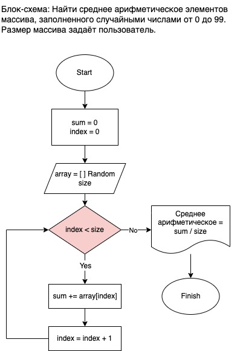

 ## Описание алгоритма работы программы

1. С помощью этой программы можно вычислить среднее арифметическое любых случайных чисел от 0 до 99. При этом размер массива задаёт пользователь в любом размере.

2. На блок-схеме визуализирован процесс работы алгоритма, где в прямоуголнинике указанны переменные кода, определящие размер памяти, а в параллелограмме - значения, которые вводит пользователь для определения размера массива. Метод Random указывает на то, что массив будет заполняться случайными числами. 

3. Вычесления проводятся с использованием цикла  for, который на каждой итерации выводит случайное число в переменную, а затем в консоль. 

4. Среднее арифметическое вычисляется сразу после выхода программы из цикла, и результат вычисления выдаётся в консоль без его сохранения в какой-либо переменной. 

5. Для введения трёхназчных и более чисел код легко меняется. 

6. Для более точных расчётов в коде предусмотренна возможность получения дробной величины.  